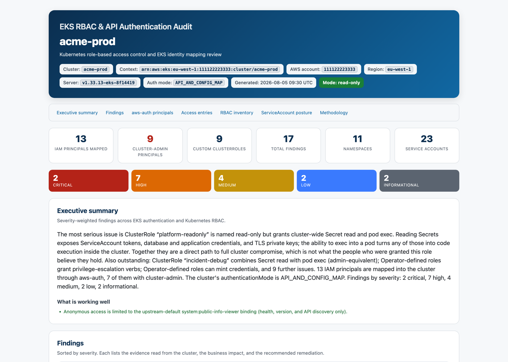
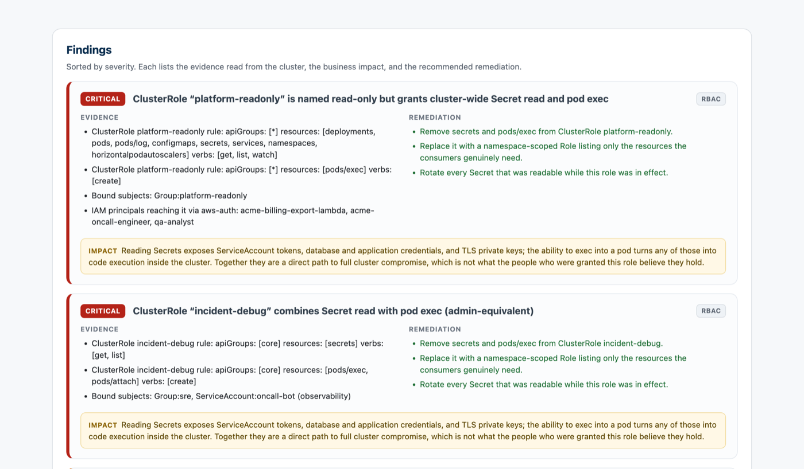
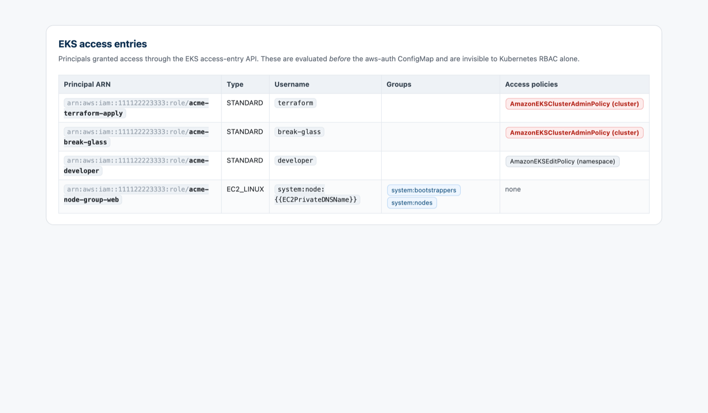

# eks-rbac-audit

[](https://github.com/amartinawi/eks-rbac-audit/actions/workflows/ci.yml)
[](https://www.python.org/downloads/)
[](LICENSE)

A **read-only** auditor for Kubernetes RBAC and EKS authentication. Point it at
any kubectl context; get one self-contained HTML report that opens offline.

```bash
python3 eks_rbac_audit.py --context my-cluster --open
```

### 👉 [See a live example report](https://amartinawi.github.io/eks-rbac-audit/)

[](https://amartinawi.github.io/eks-rbac-audit/)

<sub>Generated from a fictional cluster by
[`examples/generate_demo.py`](examples/generate_demo.py). No real cluster was audited.</sub>

It answers the questions an access review actually turns on:

- Which IAM principals can reach the cluster, and which of them are cluster admins?
- Are any of those admins machines holding credentials that never expire?
- Does a role called `cluster-reader` actually grant Secret read and pod exec?
- Is access still driven by the `aws-auth` ConfigMap, by EKS access entries, or — silently — by both at once?
- Would an incident be reconstructable from the control-plane audit log?

That fourth question is the one most audits miss. **EKS access entries are
evaluated before the `aws-auth` ConfigMap**, so cluster admins granted through
the AWS API are invisible to anyone reading Kubernetes RBAC or the ConfigMap
alone. This tool reads both.

---

## Read-only guarantee

**Against the cluster, this tool only reads.** It issues `get`, `auth can-i`,
`version`, `cluster-info`, and the read-only krew plugins `rbac-lookup` and
`who-can`. It never creates, updates, patches, replaces, deletes, or applies
anything.

This is enforced in code, not promised in a README. Every command passes through
a single chokepoint ([`eksaudit/kubectl.py`](eksaudit/kubectl.py)) that validates
the verb against an allowlist **before** spawning a process; a mutating verb
raises `ReadOnlyViolation` instead of running.
[`tests/test_kubectl.py`](tests/test_kubectl.py) asserts 23 mutating commands are
refused, and CI fails the build if any mutating verb ever becomes reachable.

On AWS it calls only `eks describe-cluster`, `eks list-access-entries`,
`eks describe-access-entry`, and `eks list-associated-access-policies`.

It never runs `get secrets`, so Secret *contents* cannot reach the report.

**Two optional actions write to your local machine, never to the cluster:**

| Action | Writes | Disable with |
|---|---|---|
| Installing missing krew plugins | `~/.krew` | `--no-install` |
| Switching the kubeconfig context | `~/.kube/config` | off by default; only with `--use-context` |

By default the context is passed as `--context` per command, so your kubeconfig is
never modified and two audits can run concurrently without interfering.

Every command that ran, with its exit code, appears in the report's
**Methodology** section — the actual log, not a static list.

---

## Install

```bash
git clone https://github.com/amartinawi/eks-rbac-audit.git
cd eks-rbac-audit
python3 -m venv .venv && . .venv/bin/activate
pip install -r requirements.txt
```

Requires Python 3.9+ and `kubectl` on `PATH`.

**PyYAML is optional.** Without it the `aws-auth` ConfigMap is parsed by a
built-in fallback that is tested to produce identical results — CI runs the whole
suite with PyYAML uninstalled to prove it.

<details>
<summary><b>Optional: krew plugins and the AWS CLI</b></summary>

[`rbac-lookup`](https://github.com/FairwindsOps/rbac-lookup) and
[`who-can`](https://github.com/aquasecurity/kubectl-who-can) enrich the
effective-permission analysis. The tool installs them if
[krew](https://krew.sigs.k8s.io/docs/user-guide/setup/install/) is present, or
skips those sections and says so:

```bash
kubectl krew install rbac-lookup who-can
```

If the AWS CLI is configured for the cluster's account, the audit also reads the
EKS control plane — authentication mode, access entries, endpoint exposure, and
logging posture. Without it the audit still runs and affected findings are
labelled **unverified**.

</details>

---

## Usage

```bash
# Current context
python3 eks_rbac_audit.py

# A specific context, opening the report when done
python3 eks_rbac_audit.py --context my-cluster --open

# Keep raw dumps for forensics, plus machine-readable findings
python3 eks_rbac_audit.py --context my-cluster \
  --work-dir ./audit-data --keep-data --json findings.json

# Kubernetes RBAC only: no AWS calls, no plugin installation
python3 eks_rbac_audit.py --no-aws --no-install -q
```

### Options

| Flag | Default | Description |
|---|---|---|
| `--context NAME` | current context | kubectl context to audit. |
| `--output PATH` | `eks_rbac_auth_audit_<context>_<date>.html` | Where to write the report. |
| `--work-dir DIR` | a temp directory | Where raw JSON/text dumps go. |
| `--keep-data` | off | Retain the raw dumps instead of deleting them. |
| `--json PATH` | off | Also write findings as structured JSON. |
| `--open` | off | Open the report in the default browser. |
| `--no-install` | off | Never install krew plugins; skip those sections. |
| `--no-aws` | off | Skip EKS control-plane enrichment entirely. |
| `--use-context` | off | Switch the kubeconfig context (writes `~/.kube/config`). |
| `--admin-threshold N` | `3` | Standing cluster-admin count above which a finding is raised. |
| `--timeout SECS` | `60` | Per-command timeout. |
| `-q`, `--quiet` | off | Print only the final summary. |
| `--version` | — | Print the version and exit. |

Exit codes: `0` success, `2` bad arguments or unknown context, `3` cluster unreachable.

### Works on any cluster

Non-EKS contexts — OpenShift, kind, plain Kubernetes — get the full RBAC audit
with the EKS sections and framing dropped. Output is deterministic: re-running
against unchanged cluster state produces a report differing only in its timestamp.

---

## What the report contains

Each finding carries the evidence read from the cluster, the business impact, and
the remediation — so the person who has to fix it does not have to go and work
out what it means first.



The EKS access-entry table is the part most audits are missing entirely:



Full contents:

- **Header** — cluster name, context, AWS account, region, server version, authentication mode, read-only badge.
- **KPI tiles and severity bar** — mapped principals, cluster admins, custom ClusterRoles, findings, namespaces, ServiceAccounts.
- **Executive summary** — assembled from the findings, plus an explicit list of controls verified sound.
- **Findings** — one card each, most severe first, with Evidence, Impact, and Remediation.
- **`aws-auth` principal table** — every mapped IAM principal, its Kubernetes username, and groups, with `system:masters` highlighted.
- **EKS access entries** — the grants the ConfigMap cannot show.
- **RBAC inventory** — object counts, who can reach `cluster-admin`, operator-defined ClusterRoleBindings.
- **ServiceAccount token posture** — how many workloads mint API tokens they may not need.
- **Methodology** — every command executed, with exit codes.

### The rules

Full reference with rationale and false-positive analysis in
**[docs/findings.md](docs/findings.md)**.

| Rule | Severity | Detects |
|---|---|---|
| R1 | CRITICAL | A role whose *name* implies read-only that grants Secret read or pod exec. |
| R2 | CRITICAL | Any custom role combining Secret read with pod exec (admin-equivalent). |
| R3 | HIGH | Automation principals (CI, pipelines, bots) with permanent cluster-admin. |
| R3b | HIGH | IAM users holding cluster-admin through non-expiring access keys. |
| R4 | HIGH | EKS access entries carrying `AmazonEKSClusterAdminPolicy` at cluster scope. |
| R5 | CRITICAL | A node-group IAM role mapped to `system:masters`. |
| R6 | HIGH | Node mappings deviating from the required EKS pattern. |
| R7 | CRITICAL/HIGH | Anonymous or unauthenticated access beyond the upstream default. |
| R8 | HIGH | Operator-defined wildcard ClusterRoles outside `cluster-admin`. |
| R9 | HIGH/CRITICAL | The `default` ServiceAccount bound to a Role or ClusterRole. |
| R10 | HIGH | `escalate`, `bind`, or `impersonate` in operator-defined roles. |
| R11 | HIGH | Roles that can mint credentials (`serviceaccounts/token`, CSRs). |
| R12 | MEDIUM | More standing cluster admins than `--admin-threshold`. |
| R13 | MEDIUM/LOW | `aws-auth` posture, keyed off the cluster's real `authenticationMode`. |
| R14 | MEDIUM | Public API endpoint open to `0.0.0.0/0`, or audit logging disabled. |
| R15 | LOW | ServiceAccount tokens auto-mounted on nearly every workload. |
| R16 | LOW | Controller and add-on ServiceAccounts retaining Secret read. |
| R17 | INFORMATIONAL | The caller context the audit ran under, and what it could not see. |

Rules that find nothing emit an INFORMATIONAL finding stating what was checked.
A clean result and an unchecked one must never look the same.

### Caveats the report states about itself

- **`who-can` cannot evaluate pod subresources.** It has no answer for
  `create pods/exec`, so exec rights are read directly from the role rules
  instead.
- **Roles labelled `kubernetes.io/bootstrapping: rbac-defaults`** — `admin`,
  `edit`, `view`, `cluster-admin` — are upstream Kubernetes defaults, reconciled
  by the API server on every restart. They are excluded from operator-defined
  rules; flagging them would raise two false CRITICALs on every cluster alive.
- **Findings are bounded by what the auditing identity could read.** Any API
  group it could not list is recorded as a collection caveat.
- **`unverified`** marks a finding that could not be confirmed against the EKS
  control-plane API.

---

## Documentation

| | |
|---|---|
| [Live example report](https://amartinawi.github.io/eks-rbac-audit/) | What the tool actually produces, from a fictional cluster |
| [docs/findings.md](docs/findings.md) | Every rule: what it detects, why that severity, what looks similar but is fine |
| [docs/architecture.md](docs/architecture.md) | Module map, data flow, and why the layers split where they do |
| [docs/writing-rules.md](docs/writing-rules.md) | How to add a finding rule |
| [CONTRIBUTING.md](CONTRIBUTING.md) | Setup, conventions, and the two hard rules |
| [SECURITY.md](SECURITY.md) | Reporting vulnerabilities; the design invariants |
| [CHANGELOG.md](CHANGELOG.md) | Release history |

## Testing

```bash
python3 -m pytest tests/ -q     # 168 tests, fully offline
```

No cluster, no AWS credentials, no network. 89% statement coverage. CI runs the
suite on Python 3.9–3.13, plus a job with PyYAML uninstalled to exercise the
fallback parser, plus a dedicated job asserting the read-only allowlist.

What the tests pin down:

- **The read-only guarantee** — every mutating verb refused ([`test_kubectl.py`](tests/test_kubectl.py)).
- **Every rule** — fires at the right severity, stays quiet on a well-configured cluster ([`test_analyze.py`](tests/test_analyze.py)).
- **Graceful degradation** — missing `aws-auth`, forbidden API groups, unparseable JSON, absent plugins, and the webhook-authorizer caveat all warn and continue ([`test_collector.py`](tests/test_collector.py)).
- **Report integrity** — no external references, CSS survives inlining, hostile cluster names escaped, byte-identical across runs ([`test_render.py`](tests/test_render.py)).

All fixtures are synthetic. See [tests/fixtures/README.md](tests/fixtures/README.md).

## License

[MIT](LICENSE) © Amar Tinawi
